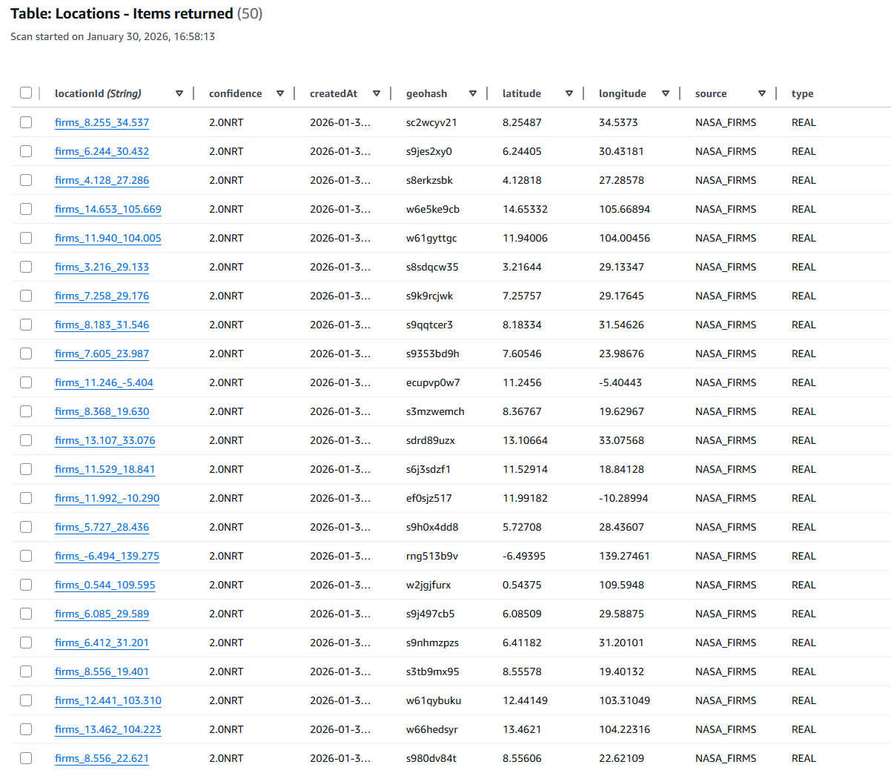
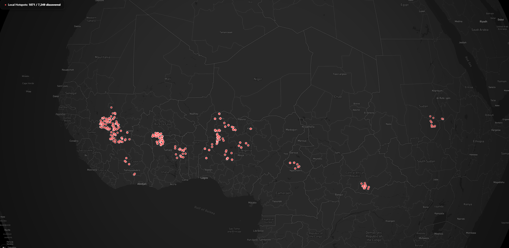
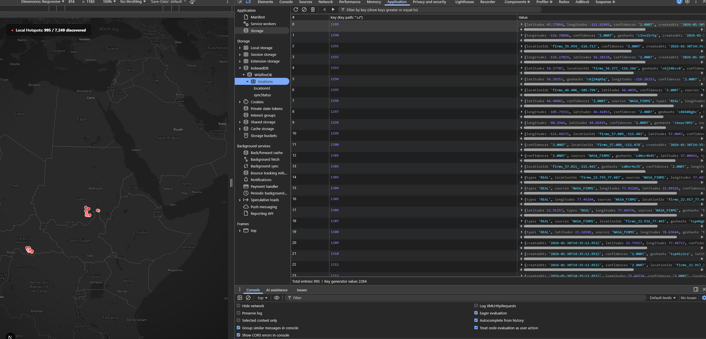

# The Road to Signal Zero

## The Mission
A fire map is useless if it goes blank when the cellular signal drops.  
I set out to build a surveillance tool that didn’t just *display* data—but **survived hostile connectivity environments** where first responders actually work.

Below is the technical evolution of how I moved from a *concept* to an **offline-first system** in **24 hours**.

---

## Phase 1: Discovering *Spatial Blindness* of the Cloud

Started with a standard **Serverless architecture**:

- AWS Lambda  
- DynamoDB  

### The Bottleneck
Our initial radius search was sluggish (**300ms+**) when there was only 100 items.
I realized that this would be a huge bottleneck especially with how **scans** work with DynamoDB and the fact that its **spatially blind**.
It was scanning all the tables since it needs to retrieve both the _lat_ and _long_, and you also can't set a range for queries.

- Location was stored as raw `latitude` / `longitude`
- Queries required **scanning every item**

> Note: Geohash also took 300ms because the calls were made locally instead of AWS Lambda. However the effieciency shows that it is ready to scale
Scan: 50ms processing + 300ms network = ~350ms
Query: 5ms processing + 300ms network = ~305ms

### The Pivot: Geohashing
I looked for ways to go around this since we need 2 different types of data and how to effectively query them in the geospatial field.
I found that its best to stop treating location as two numbers and instead implemented **Geohashing**.

- Collapsed 2D coordinates into a **1D string prefix** (e.g. `c2z`)
- Enabled efficient **prefix-based queries**
- Replaced:
  - Full table scans  
  - index queries

### The Result
- Query times dropped from **seconds → sub-100ms**
- Performance remained stable as the dataset grew even with **~22,000 points** 

---

## Phase 2: The *“Empty Map”* & Data Ingestion

With the database optimized, I connected the ingestion pipeline to **NASA’s VIIRS SNPP satellite telemetry** to pull real-world fire data.

The system broke again.

### The Batch Wall
- Attempted to ingest **22,000+ hotspots**
- DynamoDB throttled writes
- Nearly **15,000 items were dropped per batch**

### The Fix: Recursive Retry Loop
Rewrote the ingestion engine to handle DynamoDB backpressure properly.

- Detects `UnprocessedItems`
- Pauses intelligently
- Recursively retries in chunks
- Guarantees **100% data integrity**

### The “Invisible” Index
Even after ingestion succeeded, the map was still blank.

**Root cause:**  
- Lambda had access to the **Table**
- But *not* to the **Global Secondary Index (GSI)**

I was only able to find the root cause of this because CloudWatch logs exposed a silent AccessDeniedException tied specifically to the GSI ARN.
That was the moment it clicked: DynamoDB treats GSIs as separate resources for IAM, even though they feel like part of the table.

---

### Phase 2.5: Data Deduplication (Why 22K → 7.2K)

The reason only **~7.2K items** appear instead of the full **22K** is intentional deduplication during ingestion.

The ingestion script groups fire hotspots that are within roughly ~100 meters of each other using this logic:

const locationId = `firms_${latitude.toFixed(3)}_${longitude.toFixed(3)}`;

Rounding coordinates to 3 decimal places **merges nearby hotspots into a single logical location**. This prevents overlapping markers on the map and reduces storage and query load.

This is especially common for large fires where multiple satellite detections cluster tightly together.

---

## Phase 3: Offline Workflow

### The Architecture Shift
Moved away from a purely online model and adopted an **offline-first design** since most of the data are setup by now.

- Integrated **Dexie.js (IndexedDB)**
- Created a **mini-database inside the browser**

### The Offline Workflow
The app now:

- Caches **7,249+ fire records locally**
- Allows users to:
  - Pan the map
  - Query hotspots
  - Click-to-report new fires  
- Works **fully offline**

### The Sync Mechanism
A background **service worker** handles recovery:

- Detects connectivity restoration
- Automatically syncs pending reports to the cloud
- Ensures **zero data loss** in dead zones

---

## Phase 4: Final Stretch (CI/CD)

We needed safe, repeatable deployments (under time constraint).

### The Testing Problem
Used **Cypress smoke testing,**and immediately failed.

- WebGL maps (Mapbox) render **non-deterministically**
- Pixel-based assertions are unreliable in headless CI

### The QA Pivot
Instead of testing pixels, we tested **state convergence**.

**Hotspot Counter = Source of Truth**

- Only populates when:
  - Map loads
  - API responds
  - Local IndexedDB is synced

If the counter is correct, the system is healthy.

### The Pipeline
**GitHub Actions CI/CD**:

- Automatic linting
- TypeScript strict builds
- Deterministic smoke tests

**Result:** regressions (WILL) be caught *before* they reach production (ignore the fact that there's only 1 test in there).

---

## FINAL OUTCOME

Made an **offline-first system** designed for real-world failure modes:

- Scales spatially
- Survives network loss
- Preserves data integrity
- Ships safely and repeatedly (hopefully; but guaranteed locally)

**Most importantly, the map isn't blank and is actually using stored data from NASA Firms API**
