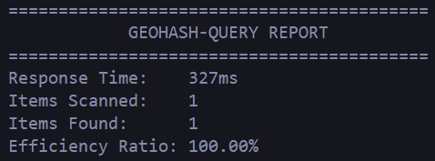
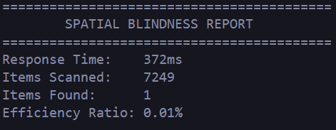

# signal-zero

**Offline-first wildfire mapping for remote field operations**

## Overview

signal-zero is a spatial surveillance tool built to solve a critical problem: **wildfire response teams operate in areas where cellular service is unreliable or nonexistent.** Standard mapping tools fail when the network drops, leaving crews without access to critical spatial data.

The system ensures that fire hotspot data remains accessible regardless of connectivity status, enabling continuous operations in the "deep woods" where first responders actually work.

## Why I Built This

After researching Hummingbird Drones' wildfire operations in BC, I wanted to understand the technical challenges of building mapping tools for low-connectivity environments where first responders operate. This project taught me geospatial engineering from the ground up.

## Technical Deep-Dive

For a detailed breakdown of the engineering challenges and solutions, see [JOURNEY.MD](./JOURNEY.MD).

Topics covered:
- Breaking spatial blindness in NoSQL databases
- Solving DynamoDB write throttling at scale
- Building robust offline-first data sync
- Testing WebGL maps in CI/CD pipelines
## Tech Stack

**Frontend**
- React + TypeScript
- MapBox GL JS (WebGL rendering for 20k+ points)
- Dexie.js (IndexedDB wrapper)
- Service Workers (offline tile caching)

**Backend**
- AWS Lambda (serverless compute)
- DynamoDB (geospatial indexing via geohashing)
- NASA VIIRS API (satellite fire telemetry)

**Infrastructure**
- GitHub Actions (CI/CD pipeline)
- Cypress (E2E testing)
- TypeScript strict mode (type safety)

## Key Features

### High-Performance Rendering
- Renders 22,000+ fire hotspots without browser lag
- Uses GeoJSON sources + WebGL layers (not DOM markers)
- Sub-100ms query times via geohashed spatial indexing

###  Offline-First Architecture
- Full map functionality in zero-connectivity zones
- IndexedDB caching of all hotspot data
- Service Worker-based tile persistence
- Automatic sync when connection returns

### Real-Time Data Ingestion
- Automated NASA VIIRS satellite data pipeline
- Recursive retry logic for 100% data integrity
- Handles 22,000+ item batches with DynamoDB write throttling

### CI/CD
- Cypress E2E test suite
- CI/CD via GitHub Actions
- TypeScript strict type checking
- Automated smoke tests on every PR

## Architecture Highlights

**Geospatial Indexing**

Standard approach: Scan entire table for lat/lon matches (0.01% efficiency)      
Geohash approach: Geohash prefix queries on DynamoDB GSI (100% efficiency)      

**Offline Sync Pattern**

1. User operates offline → writes to IndexedDB
2. Service Worker heartbeats network status
3. Connection detected → batch sync to AWS Lambda
4. Lambda updates DynamoDB → frontend reflects changes

**Built with** 🔥 **for the frontlines**

